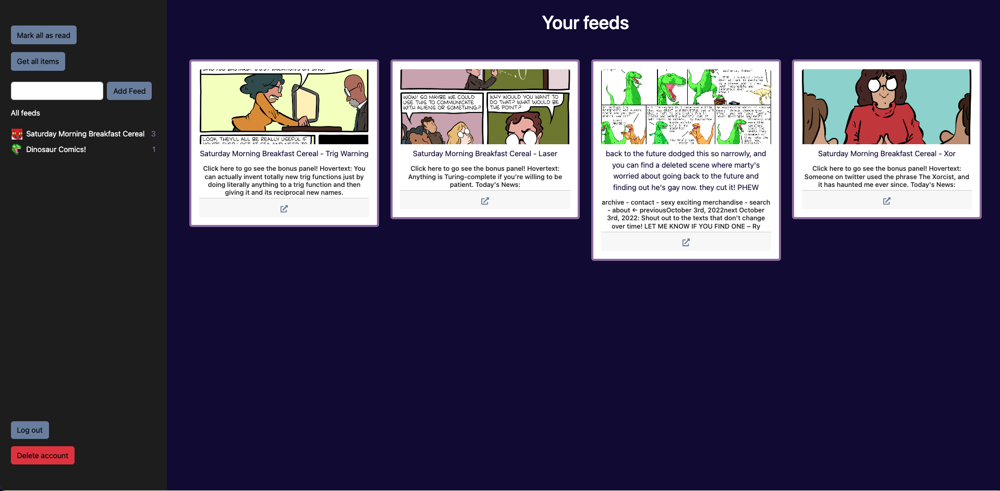

# Simple RSS

A basic RSS feed. This product was created out of frustration with other products, from fancy UI trying to keep you in their site to popping ads into the feeds.

I created this site with for a basic RSS experience with no ads. It's simple to create an account and manage your feeds.

Local environment is configured with dotenv. To use this, create a .env file in the web folder and fill in the fields MONGODB_URI, NEXT_PUBLIC_VERCEL_URL (value http://localhost:3000), and JWT_SIGNING

-- Jay
